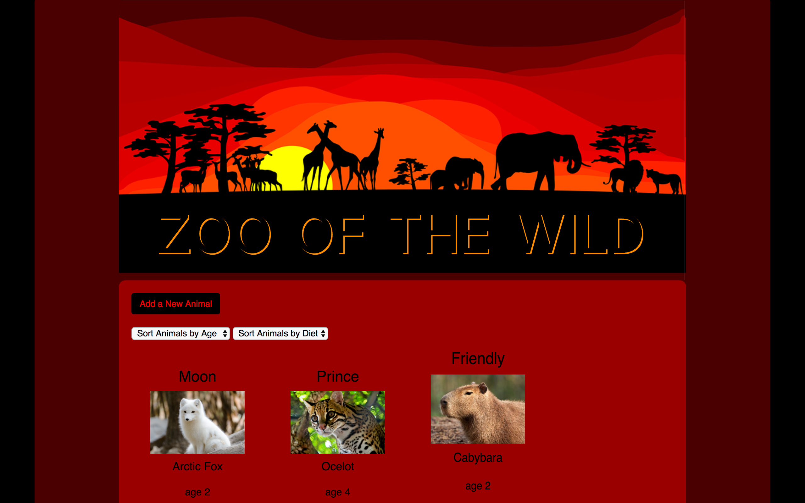

# Zoo-Of-The-Wild

### User Stories
* I want to log a newly-admitted animal by submitting a form with animal species, name, age, diet, zoo location, number of needed caretakers, sex, one like and one dislike.
* I want to view a list of animals I have logged.
* I want options to view all animals, only young animals (less than 2 years of age), or only mature animals (more than 2 years of age).
* I want options to view all animals, only omnivores, only herbivores, or only carnivores.
* I want to click an animal to edit its name, age or caretakers.
* I want to be able to remove an animal that is no longer at the zoo.
* I want to add the date when animal was admitted.

### Stretch Goals
* I want to show upcoming Anniversaries for animals at the zoo.
* Display number of caretakers by day.
* I want to sort by species.
* I want to show the locations of the animals on a zoo map.
* I want the Animal model to include the medical chart and any other information from volunteers or caretakers.
* I want to sort animals by location.

### Setup/Installation Requirements
- [ ] clone https://github.com/callmedw/ZOTW.git
- [ ] navigate to the project's directory
- [ ] run this series of commands:
  * `$ npm install`
  * `$ bower install`
  * `$ gulp build`
  * `$ gulp serve`

### Built With
* HTML
* CSS
* Angular
* JavaScript
* Typescript

### Known Bugs
List known bugs or issues here

### Authors
Dana Weiss

### License
*open source GPL & MIT*
